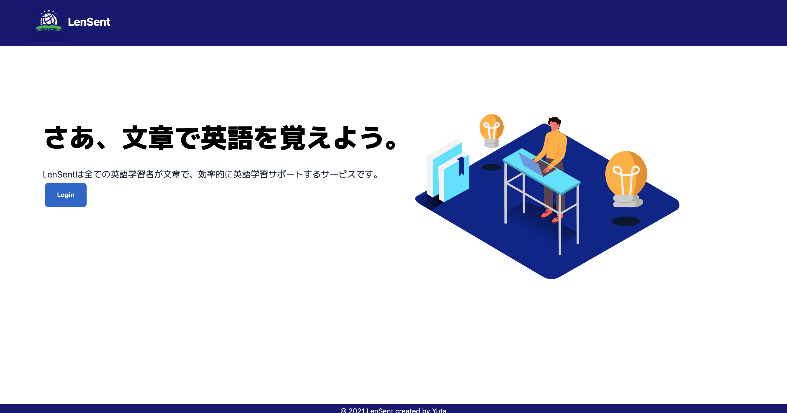

# ポートフォリオ「LenSent」紹介

## 概要
LenSentは英語を文章で覚えることをサポートするアプリケーションです。  
文章と一緒に単語、熟語を覚えることで、効率よく英語を習得できるようにします。

## 作成背景
私自身オンライン英会話で英語を学習しておりました。オンライン英会話では英文をもとに、  
外国人の方とディスカッション実施し、その英文や先生とやりとりした内容をもとに英単語や熟語、  
会話表現などを学びました。そして、レッスン終了後、扱った英文のリンクと学んだ表現などを  
OneNoteでメモしておりましたが、回数を重ねる毎に毎回メモと単語や英熟語の日本語訳を  
OneNoteに記入していくのが面倒になったのが、きっかけです。  

# 技術概要
## フロントエンド(https://github.com/Yuta-K19418/lensent-next-js)
* TypeScript	
	* NextJS
	* React
* TailWindCSS
* eslint/prettier

## バックエンド(https://github.com/Yuta-K19418/lensent-golang)
* Golang
	* gin
	* gorm
* PostgreSQL
* GoogleAppsScript
* Auth0

## インフラ
* Docker/docker-compose